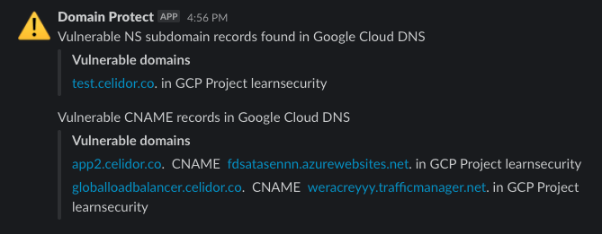

# domain-protect-gcp
* Scans Google Cloud DNS across a GCP Organization for domain records vulnerable to takeover
* Amazon Route53 vulnerable domains can be detected by [Domain Protect](https://github.com/ovotech/domain-protect)

### deploy to security audit project and scan your entire GCP Organization


### receive alerts by Slack or email

<kbd>
  
</kbd>

### or manually scan from your laptop


## subdomain detection functionality
Scans Google Cloud DNS for:
* Subdomain NS delegations vulnerable to takeover
* CNAME records for missing Google Cloud Storage buckets
* A records for Google Cloud Load Balancer with missing storage bucket backend  
* Vulnerable CNAME records for Azure resources
* Vulnerable CNAME records for AWS resources  
* CNAME for Amazon CloudFront distributions with missing S3 origin
* CNAME for Amazon S3 website

## options
1. scheduled Google Cloud Functions with Slack alerts, across a GCP Organization, deployed using Terraform
2. [manual scans](manual-scans/README.md) run from your laptop or Cloud Shell

## notifications
* Slack channel notification per vulnerability type, listing account names and vulnerable domains

## requirements
* Storage bucket for Terraform state file
* Terraform 1.0.x
* Service Usage API enabled on Google Cloud project

## deployment permissions
The Terraform service account requires the following roles at the Project level:
```
App Engine Creator
Cloud Functions Developer
Cloud Scheduler Admin
Create Service Accounts
Project IAM Admin
Pub/Sub Admin
Service Account Admin
Service Account User
Service Usage Admin
Storage Admin
```

## usage
* replace the Terraform state Google Cloud Storage bucket fields in the command below as appropriate
* for local testing, duplicate terraform.tfvars.example, rename without the .example suffix
* enter details appropriate to your organization and save
* alternatively enter Terraform variables within your CI/CD pipeline
* check whether App Engine has been created in the infrastructure project
* add Terraform variables ```create_app_engine``` and ```app_service_region``` if different from default

```
terraform init -backend-config=bucket=TERRAFORM_STATE_BUCKET -backend-config=prefix="terraform/state/domain-protect-gcp"
terraform workspace new dev
terraform plan
terraform apply
```

## manually apply audit permissions at org level
* At the organisation level, IAM, apply the following permissions to the domain-protect service account:
```
DNS Reader (roles/dns.reader)
Folder Viewer (roles/resourcemanager.folderViewer)
```
* This step is performed manually to avoid giving org wide IAM permisssions to the deployment service account

## adding notifications to extra Slack channels
* add an extra channel to your slack_channels variable list
* add an extra webhook URL or repeat the same webhook URL to your slack_webhook_urls variable list
* apply Terraform

## developing new checks
* New checks can be tested locally from your laptop
* Log in to GCP using ```gcloud auth login```
* Ensure you have installed the relevant Python modules locally or in your virtual environment using ```pip install```
* Export environment variables from your command line, e.g. 
```
export SECURITY_PROJECT=mygcpproject896783
export APP_NAME=domain-protect
export APP_ENVIRONMENT=dev
```
* Temporarily comment out and uncomment lines as detailed in the code
* Revert after successful local testing

## ci/cd
* infrastructure has been deployed using CircleCI
* environment variables to be entered in CircleCI project settings:

| ENVIRONMENT VARIABLE            | EXAMPLE VALUE / COMMENT                          |
| ------------------------------- | -------------------------------------------------|
| GOOGLE_CLOUD_KEYFILE_JSON       | JSON keyfile downloaded from GCP console         |
| GOOGLE_APPLICATION_CREDENTIALS  | google_cloud_keyfile.json                        | 
| TERRAFORM_STATE_BUCKET          | tfstate78936                                     |
| TERRAFORM_STATE_KEY             | terraform/state/domain-protect-gcp               |
| TF_VAR_project                  | mycoolgcpproject                                 |       
| TF_VAR_slack_channels           | ["security-alerts"]                              |
| TF_VAR_slack_channels_dev       | ["security-alerts-dev"]                          |
| TF_VAR_slack_webhook_urls       | ["https://hooks.slack.com/services/XXX/XXX/XXX"] | 

* to validate an updated CircleCI configuration:
```
docker run -v `pwd`:/whatever circleci/circleci-cli circleci config validate /whatever/.circleci/config.yml
```

## limitations
* this tool cannot guarantee 100% protection against subdomain takeover
* it only scans Google Cloud DNS, and only checks a limited number of takeover types
* for detection of Amazon Route53 vulnerable domains use [Domain Protect](https://github.com/ovotech/domain-protect)